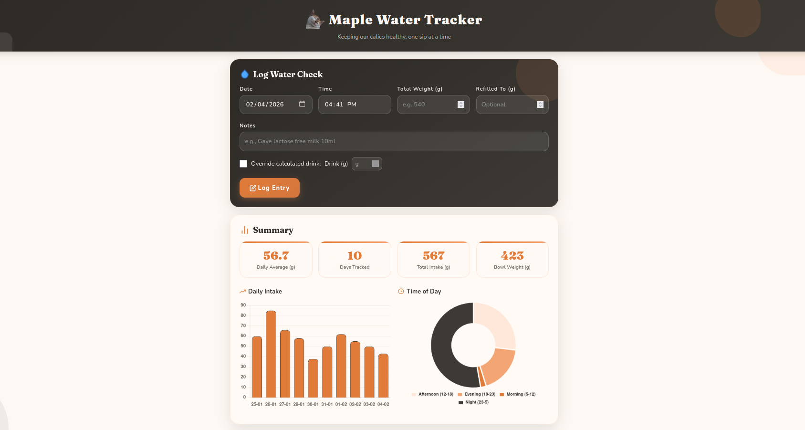
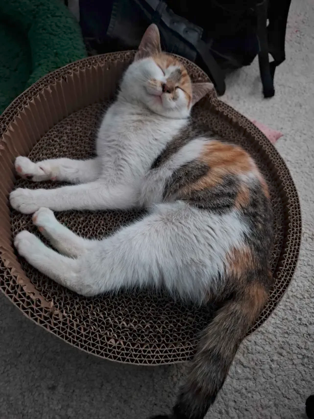

# Maple Water Tracker

A local Flask web app to track your cat's water intake, with a warm ginger-and-charcoal color scheme 
inspired by Maple's beautiful calico coat!

Designed for use on your home network so multiple family members can log data from their phones.

**Database:** SQLite (simple file-based, zero configuration)

<div align="center">



</div>

## Features

- **Quick logging:** Enter total bowl weight, app calculates water and drink amounts
- **Edit & delete entries:** Fix mistakes or remove incorrect logs
- **Daily charts:** See water intake trends over time
- **Time-of-day breakdown:** Understand when your cat drinks most
- **Vet export:** Download reports in TXT or CSV format
- **Import existing data:** Paste your raw text format data
- **Mobile-friendly:** Works great on phones and tablets
- **SQLite database:** Reliable storage, easy to backup


## Setup

### 1. Install Python dependencies
For development or production:
```bash
# Requirements for development only
python -m pip install -e ".[dev]"

# Requirements for production only
python -m pip install -e ".[prod]"

# Requirements with development tools and production dependencies 
python -m pip install -e ".[all]"
```

Via `requirements.txt`
```bash
# Minimum requirements
python -m pip install -r requirements.txt

# Development and deployment requirements
python -m pip install -r requirements-dev.txt
```

#### 1.1 Import your existing data (optional)
If you have existing data in raw text format:
```bash
python runnable/import_to_db.py --data-file=data-raw.txt --cat-name="Maple"
```

Or use via project script (if installed via `python -m pip install -e`):
```bash
maple-import --data-file=data-raw.txt --cat-name="Maple"
```

### 2. Run the app

```bash
python web/app.py
```

Or use via project script (if installed via `python -m pip install -e`):
```bash
maple-tracker
```

### 3. Access the app

- **On the same computer:** http://localhost:5000
- **From other devices:** http://YOUR_LOCAL_IP:5000

To find your local IP:
- **Linux:** Open Terminal, type `ip addr` or `hostname -I`
- **Macintosh:** Open Terminal, type `ifconfig | grep "inet "` or go to System Preferences > Network
- **Windows:** Open Command Prompt, type `ipconfig`, look for "IPv4 Address"

Your IP will look something like `192.168.1.XXX`

### Deploy
For deployment options please check [DEPLOY.md](DEPLOY.md) for instructions.

## Usage

### Logging water checks

1. Weigh the bowl (with water) on your kitchen scale
2. Enter the **total weight** in the app
3. The app auto-calculates water amount and how much Maple drank since last check
4. If you refilled the bowl, enter the **refill weight** too

### Editing entries

Click the pencil icon on any entry to edit its date, time, weights, or notes. Changes are saved immediately.


### Understanding the data

- **Water Weight** = `Total Weight - Bowl Weight` (423g by default)
- **Drink Amount** = `Previous Water Level - Current Water Level`
- After a refill, the next drink calculation uses the refill amount

### Exporting for the vet

Click "Export for Vet" and choose:
- **Vet Report:** A formatted summary with statistics
- **Full Data:** Complete CSV with all entries

## Data Storage

Data is stored in `maple.db` (SQLite). To backup:

```bash
cp maple.db maple_backup.db
```

To view the database directly:

```bash
sqlite3 maple.db
sqlite> SELECT * FROM entries ORDER BY date DESC LIMIT 10;
sqlite> .quit
```


## Troubleshooting

**Can't connect from phone?**
- Make sure your computer and phone are on the same WiFi network
- Check that your firewall allows connections on port 5000
- Try accessing with your computer's IP address, not "localhost"

**Wrong calculations?**
- Go to Settings and verify the bowl weight is correct
- Use the "Override calculated drink" checkbox to manually enter amounts
- Edit existing entries by clicking the pencil icon

**Need to reset everything?**
- Delete `maple.db` and restart the app

## License
[MIT License](LICENSE)

---

Made with 🧡🖤🤍 for Maple the caliby cat.

<div align="center">



</div>

